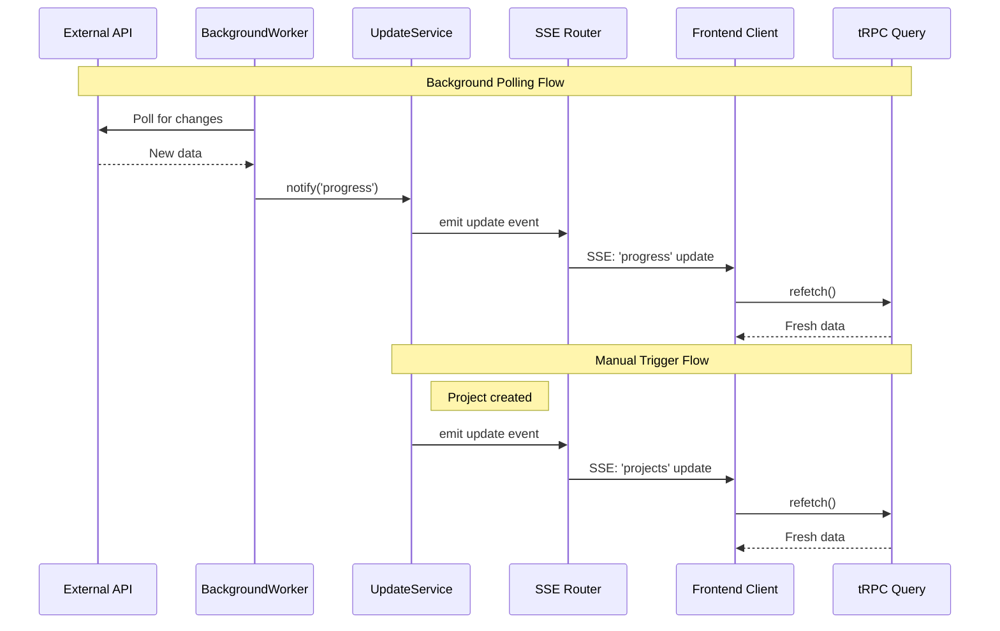
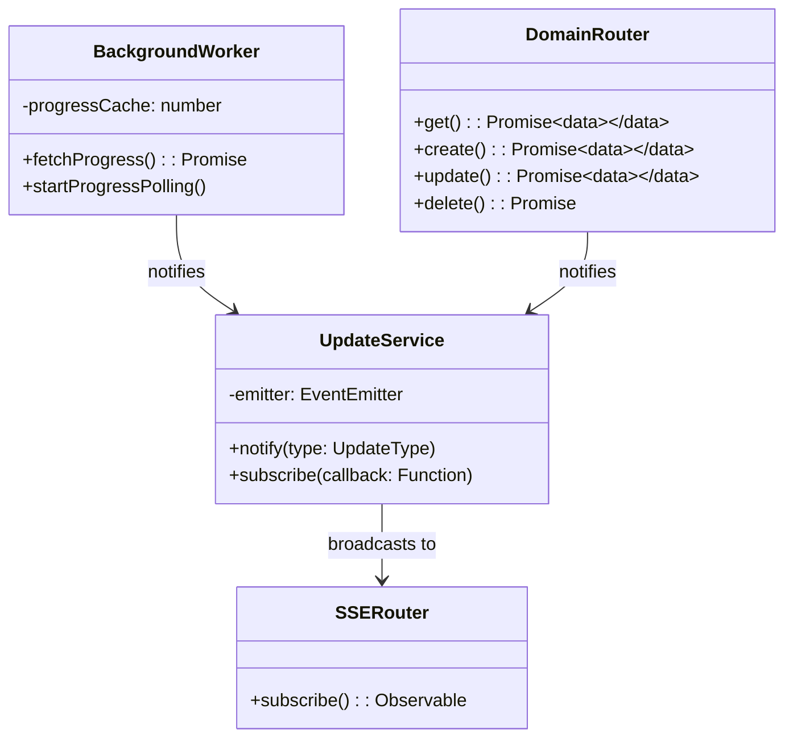

# SSE Architecture Documentation

## Overview

// Backend - von überall Updates triggern:
updateService.notify('progress') // Background Worker
updateService.notify('projects') // Project Creation
updateService.notify('compute') // Instance Creation

// Frontend - Components lauschen nur auf ihre Daten:
const progressQuery = useAutoRefetch(trpc.progress.get.useQuery(), 'progress')
const projectsQuery = useAutoRefetch(trpc.projects.getAll.useQuery(), 'projects')

✅ Ein SSE für alles statt 30+ Connections
✅ Saubere Trennung - Domain Logic getrennt von SSE
✅ Einfach erweiterbar - Neue UpdateTypes einfach hinzufügen
✅ Background Worker - Pollt externe APIs zentral
✅ Lose Kopplung - Router wissen nichts von SSE

This architecture implements a centralized Server-Sent Events (SSE) system for real-time updates in a tRPC-based application. Instead of having multiple SSE connections per data type, we use a single SSE connection that broadcasts update notifications, triggering clients to refetch specific data as needed.

## Architecture Principles

- **Single SSE Connection**: One SSE stream for all update types
- **Separation of Concerns**: Domain logic separated from real-time notifications
- **Event-Driven**: Updates triggered by business operations
- **Efficient**: Only sends lightweight notifications, not actual data
- **Scalable**: Easy to add new update types and data sources

## System Components

### Backend Components

#### 1. UpdateService

- **Purpose**: Central notification hub for all updates
- **Responsibilities**:
  - Emit update notifications by type
  - Manage subscriptions to updates
- **Location**: `server/shared/UpdateService.ts`

#### 2. BackgroundWorker

- **Purpose**: Poll external APIs and trigger updates on changes
- **Responsibilities**:
  - Monitor external data sources (e.g., `http://localhost:3000/state`)
  - Detect changes and notify UpdateService
  - Cache last known values to avoid unnecessary notifications
- **Location**: `server/shared/BackgroundWorker.ts`

#### 3. SSE Router

- **Purpose**: Handle SSE connections and stream updates
- **Responsibilities**:
  - Manage SSE subscriptions
  - Broadcast update notifications to connected clients
- **Location**: `server/SSE/sseRouter.ts`

#### 4. Domain Routers

- **Purpose**: Handle business logic and data operations
- **Responsibilities**:
  - Implement domain-specific queries and mutations
  - Trigger update notifications after data modifications
- **Location**: Various domain folders (e.g., `server/Compute/routers/`)

### Frontend Components

#### 1. useSSEUpdates Hook

- **Purpose**: Establish and manage SSE connection
- **Usage**: Initialize once per application
- **Location**: `hooks/useSSEUpdates.ts`

#### 2. useAutoRefetch Hook

- **Purpose**: Automatically refetch queries on specific update types
- **Usage**: Wrap any tRPC query to enable auto-refresh
- **Location**: `hooks/useAutoRefetch.ts`

## UML Diagrams

### System Architecture Diagram

```mermaid
graph TB
    subgraph "External APIs"
        API[http://localhost:3000/state]
    end

    subgraph "Backend"
        BW[BackgroundWorker]
        US[UpdateService]
        SSE[SSE Router]
        DR1[Progress Router]
        DR2[Project Router]
        DR3[Compute Router]
    end

    subgraph "Frontend"
        SSEHook[useSSEUpdates Hook]
        ARHook[useAutoRefetch Hook]
        COMP[Components]
    end

    API -->|Poll every 2s| BW
    BW -->|notify('progress')| US
    DR1 -->|notify('progress')| US
    DR2 -->|notify('projects')| US
    DR3 -->|notify('compute')| US

    US -->|emit updates| SSE
    SSE -->|SSE Stream| SSEHook
    SSEHook -->|Custom Events| ARHook
    ARHook -->|refetch()| COMP

    COMP -->|tRPC Queries| DR1
    COMP -->|tRPC Queries| DR2
    COMP -->|tRPC Queries| DR3
```

### Sequence Diagram: Update Flow



### Class Diagram



## Data Flow

### 1. Background Updates

```
External API → BackgroundWorker → UpdateService → SSE Router → Client → Refetch
```

### 2. User Action Updates

```
User Action → Domain Router → UpdateService → SSE Router → Client → Refetch
```

## Update Types

The system supports the following update types (extensible):

- `progress` - Progress/status updates from external APIs
- `projects` - Project creation, modification, deletion
- `compute` - Compute instance changes
- `images` - Image catalog updates
- `authentication` - User/auth related changes
- `gardener` - Gardener-specific updates

## Implementation Benefits

### Performance

- **Single Connection**: Only one SSE connection per client
- **Lightweight**: Only update notifications sent, not data
- **Efficient**: Clients only refetch data they actually use

### Maintainability

- **Separation**: Domain logic separate from real-time concerns
- **Centralized**: All updates flow through single service
- **Extensible**: Easy to add new update types

### Developer Experience

- **Simple Integration**: Wrap any query with `useAutoRefetch`
- **Declarative**: Components declare what updates they care about
- **Debugging**: Centralized logging of all updates

## Usage Examples

### Backend: Triggering Updates

```typescript
// In any domain router
import { updateService } from "../../shared/UpdateService"

export const projectRouter = {
  create: protectedProcedure.mutation(async ({ input }) => {
    const project = await createProject(input)

    // Notify all clients that projects changed
    updateService.notify("projects")

    return project
  }),
}
```

### Frontend: Consuming Updates

```typescript
// In any component
function ProjectsPage() {
  // Initialize SSE (once per app)
  useSSEUpdates()

  // Auto-refetch on 'projects' updates
  const projectsQuery = useAutoRefetch(
    trpc.projects.getAll.useQuery(),
    'projects'
  )

  return <div>{/* Render projects */}</div>
}
```

## Configuration

### Polling Intervals

- **Progress API**: 2 seconds (configurable in BackgroundWorker)
- **SSE Reconnect**: Handled by tRPC WebSocket adapter

### Error Handling

- **API Failures**: BackgroundWorker falls back to cached values
- **SSE Failures**: tRPC handles reconnection automatically
- **Client Errors**: Logged to console, doesn't break functionality

## Future Extensions

- Add more external API polling
- Implement update batching for high-frequency changes
- Add update filtering based on user permissions
- Implement update persistence for offline clients
